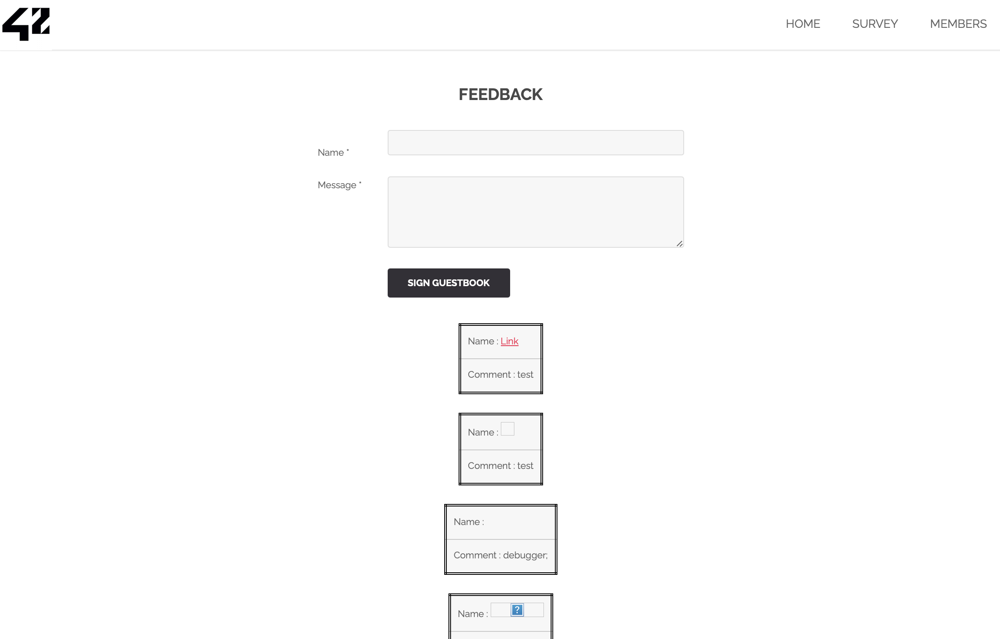
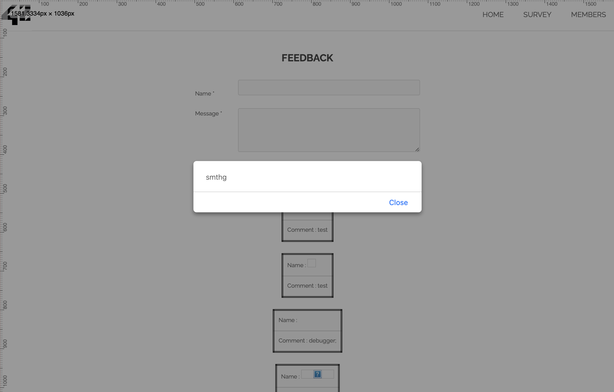

### <span style="color:blue">xss: cross site scripting</span>


**XSS definition:**
Cross-Site Scripting (XSS), is a type of computer security vulnerability typically found in web applications.
XSS allows attackers to inject malicious code into a website, which is then executed in the browser of anyone who visits the site. This can allow attackers to steal sensitive information: such as user login credentials, or to perform other malicious actions.

There are 3 main types of XSS attacks:

* **Reflected XSS**: In a reflected XSS attack, the malicious code is embedded in a link that is sent to the victim. When the victim clicks on the link, the code is executed in their browser, allowing the attacker to perform various actions, such as stealing their login credentials.

* **Stored XSS**: In a stored XSS attack, the malicious code is stored on the server, and is executed every time the vulnerable page is accessed.

* **DOM-based XSS**: is a type of XSS attack that occurs when a vulnerable web application modifies the DOM (Document Object Model) in the user's browser.

**Step 0:** 

`Submit the form:`

When filling in the `name` and `message` inputs, and then clicking the `submit` button, the submitted values are displayed on the page. After navigating to another page and then returning, the previously inserted values are still visible on the page. This means that all the previously submitted values are being stored and will be displayed to all users who access the page.
While this behavior may seem normal, it can create a security vulnerability if the data is not properly sanitized before being displayed


**Step 1:** 

`unsanitized inputs:`

let's try if we were able to inject `HTML` or `JavaScript` into the name or message fields, that code could be executed when other users view the page where the data is displayed. 
started by inputting HTML tags into the form fields to see how the application handled them. I entered the following test data:

- Input test : 
```html
* Name: <h1>this is a test</h1>
* Message: <h1>test message</h1>
```

- Output result: 
```html
Name : THIS IS A TEST
Comment : test message
```

Once I submitted the form, I expected to see the data displayed back to me in a safe, sanitized manner. However, in the Name field, the h1 tags were not escaped. Instead of showing the text `<h1> this is a test <h1/>` as plain text, the browser rendered it as a heading. 
interpreting the html tags as actual code. This caused the text `this is a test` to appear as a Heading1 on the page,
which is an indication that the form was allowing raw html tags to be inserted and rendered.
 
**Step 2:**

This behavior suggests a potential XSS vulnerability because the application did not properly sanitize or escape the HTML content submitted in the form. As a result, the browser was interpreting the h1 tags as real HTML rather than displaying them as text.
so in this second step of my testing, I wanted to see if the form was vulnerable to JavaScript injection,To do this, I input the following into the form fields:

- Input test : 

```html
* Name: <script>alert(1)</script>
* Message: test message 
```

- Output result: 
```html 
Name : alert(1)
Comment : test message 
```

- The input in the Name field (<script>alert(1)</script>) did not execute as JavaScript. Instead, it was displayed on the page as plain text: alert(1). This indicates that the script tags were sanitized or escaped to prevent them from being executed as JavaScript.

- The Message field (test message) was displayed correctly as plain text without any issues, as expected.

**Step 3:**

there's still the possibility that not all attack vectors are covered.
while <script> tags might be sanitized [partial protections, blocking only <script>], other methods of injecting JavaScript like event handler attributes, onerror, onload... , may still work if not properly sanitized and they can be used to execute JavaScript when an event is triggered.
I continue testing with more advanced injection techniques, like: 
- Event handler injections ``
- JavaScript via URL `<a href="javascript:alert(1)">Click here</a> or <a href="" onclick="alert('smthg')">link</a>`

- Input test : 
```html
* Name: <a href="" onclick="alert('smthg')">link</a>
* Message: smthg
```

- Output result: 




this injected code is not sanitized or escaped, the <a> tag is rendered directly into the page. When the user clicks the link, it triggers the onclick attribute and executes the alert('smthg') script.


**last step**

When inputting the word `script` directly into the `name` and `message` field without additional tags, it is detected as potentially dangerous. As a result, the XSS flag appears, 

- Input test : 
```html
* Name: Script 
* Message: Script 
```

- Output result: 
```html 
THE FLAG IS : 0FBB54BBF7D099713CA4BE297E1BC7DA0173D8B3C21C1811B916A3A86652724E
```


**Conclusion**


Despite various attempts to demonstrate the vulnerability, the flag only appears when certain conditions are met—such as directly injecting `script` into specific fields like "name" or "message" or simply using the `<` character in the name input. These observations highlight that while some filtering methods are in place, they don’t fully prevent XSS vulnerabilities. it illustrates the importance of robust and comprehensive filtering to guard against potential XSS attacks.


**How to prevent**

To prevent XSS attacks, it is important to:

1- Verify Output Escaping: Ensure that all user input is escaped properly in all contexts (e.g., text, links, images) to prevent any HTML or JavaScript from executing. This includes handling attributes like onclick, onload, or onerror.

2- Use Libraries/Tools: Consider using specialized libraries client-side sanitization or server-side libraries to remove potentially dangerous content. or using modern frameworks that have built-in protections against XSS by default. 

3- HTML Encode Output: When displaying data from user inputs, encode it so that it renders as text rather than HTML or JavaScript. For example, convert < to &lt; and > to &gt;.


**Resources**

- https://github.com/swisskyrepo/PayloadsAllTheThings/blob/master/XSS%20Injection/README.md